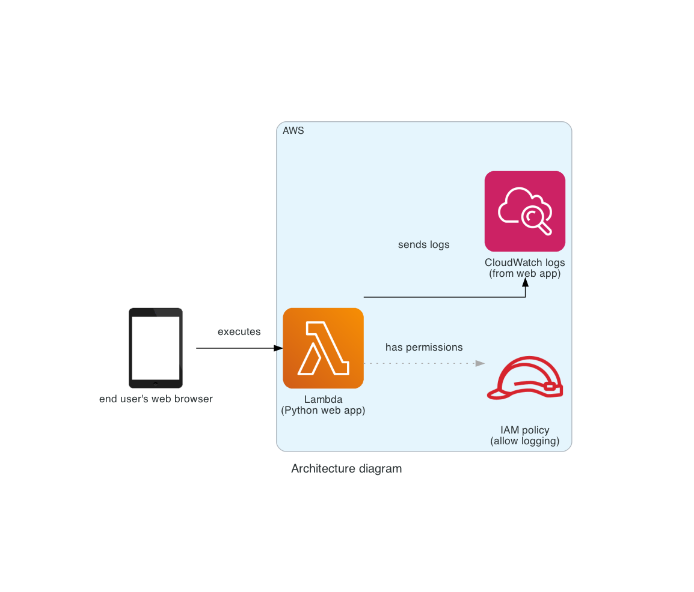

<!--
  <<< Author notes: Step 1 >>>
  Choose 3-5 steps for your course.
  The first step is always the hardest, so pick something easy!
  Link to docs.github.com for further explanations.
  Encourage users to open new tabs for steps!
-->

## Step 1: Check missing parts in Terraform code

_Welcome to "aws-terratest-course"! :wave:_

**What is the goal of step 1 ?**: In first step we are going to familiarize with simple architecture of the infrastructure and after that we will update 1 missing part in Terraform code.

### :keyboard: Activity: Check missing parts in Terraform code

1. Open a new browser tab, and work on the steps in your second tab while you read the instructions in this tab.
2. Review architecture for simple infrastructure defined in Terraform code in [infra](infra) folder.
3. On your local machine [configure authentication for AWS provider](https://registry.terraform.io/providers/hashicorp/aws/latest/docs#authentication-and-configuration).
4. Checkout remote branch using command: ``git checkout -b step1-infra origin/step1-infra``.
5. Go to ``infra`` folder using command: ``cd infra``.
6. Initialize Terraform by command: ``terraform init``.
7. Review arguments for [aws_lambda_function_url](https://registry.terraform.io/providers/hashicorp/aws/latest/docs/resources/lambda_function_url.html) resource.
8. Define ``function_name`` for resource ``aws_lambda_function_url``.
9. Try to deploy infrastructure using command: ``terraform apply``.
10. If succeeded, destroy infrastructure using command: ``terraform apply -destroy``.
11. Commit changes using command: ``git commit -am "Finish step 1"``.
12. Push changes using command: ``git push``.
13. Wait about 20 seconds then refresh this page (the one you're following instructions from). [GitHub Actions](https://docs.github.com/en/actions) will automatically update to the next step, if your solution is correct. 
14. If next step is not automatially updated, verify results in ``Actions`` tab in GitHub, fix code and repeat steps 8-13 one more time.
